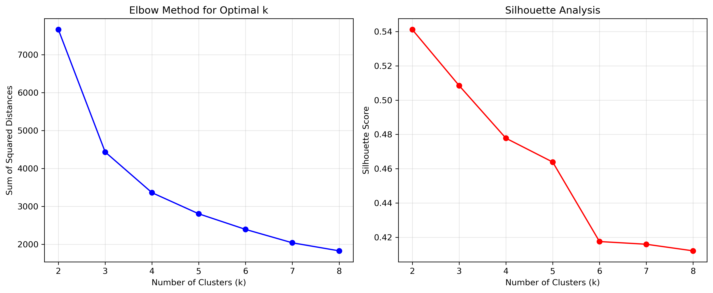
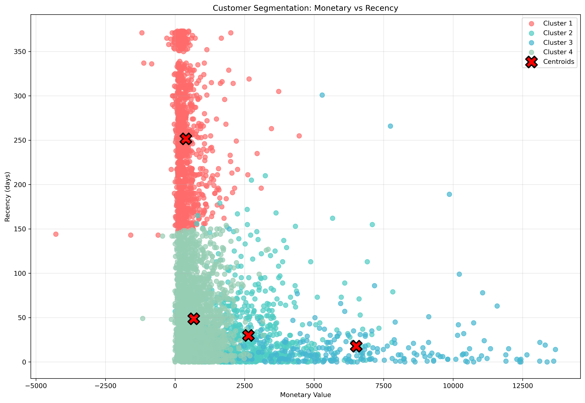
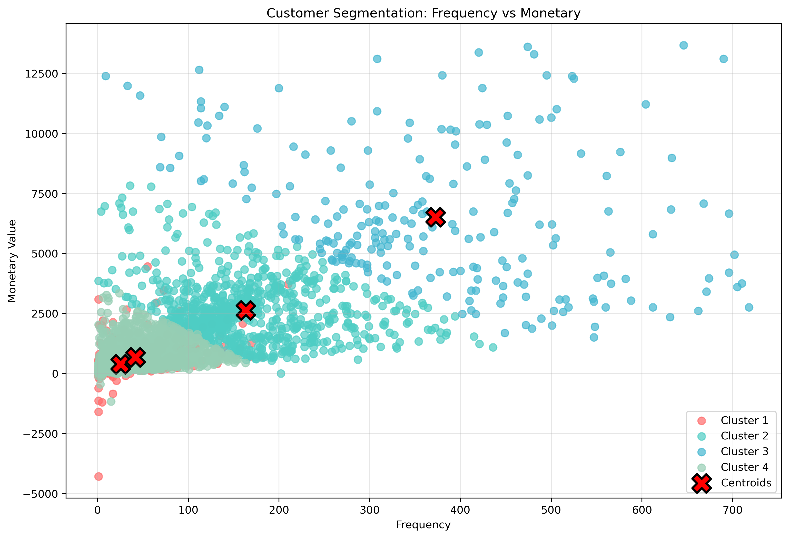
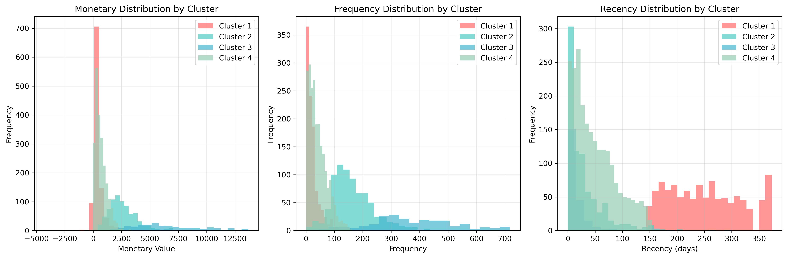

# K-Means Customer Segmentation

This project implements customer segmentation using K-Means clustering on retail data, applying RFM (Recency, Frequency, Monetary) analysis to identify distinct customer groups for targeted marketing strategies.

## Overview

Customer segmentation is a crucial business analytics technique that helps organizations understand their customer base and tailor marketing strategies accordingly. This project demonstrates how unsupervised learning can be used to segment customers based on their purchasing behavior patterns.

## Features

- **Data Preprocessing**: Cleans and prepares retail transaction data
- **RFM Feature Engineering**: Creates Recency, Frequency, and Monetary features
- **Outlier Detection**: Removes outliers using IQR method for robust clustering
- **Optimal Cluster Selection**: Uses elbow method and silhouette analysis
- **K-Means Clustering**: Implements unsupervised learning for customer segmentation
- **Comprehensive Visualizations**: Multiple plots showing cluster characteristics
- **Statistical Analysis**: Detailed cluster summaries and insights

## Methodology

### RFM Analysis
- **Recency**: Days since customer's last purchase
- **Frequency**: Number of transactions made by customer
- **Monetary**: Total amount spent by customer

### Clustering Process
1. **Data Cleaning**: Remove missing values and convert data types
2. **Feature Engineering**: Calculate RFM metrics for each customer
3. **Outlier Removal**: Use IQR method to remove extreme values
4. **Feature Scaling**: Standardize features for clustering
5. **Optimal K Selection**: Elbow method and silhouette analysis
6. **K-Means Clustering**: Assign customers to segments
7. **Visualization**: Create comprehensive plots and summaries

## Dataset

The project uses the **Online Retail Dataset** containing:
- 541,909 transactions
- 4,372 customers
- Features: InvoiceNo, StockCode, Description, Quantity, InvoiceDate, UnitPrice, CustomerID, Country

[Download Online Retail dataset](https://archive.ics.uci.edu/ml/datasets/online+retail)

## Requirements

```bash
pip install pandas numpy seaborn matplotlib scikit-learn
```

## Usage

Copy the repository:
```bash
git clone "https://github.com/Sat1x/k-means-retail"
```

Run:
```bash
python kmeans_customer_segmentation.py
```

## Outputs

The script generates several files:

### Visualizations

#### 1. Elbow Method and Silhouette Analysis (`elbow_curve.png`)


This plot shows two key metrics for determining the optimal number of clusters:
- **Left**: Elbow method showing the sum of squared distances (SSD) for different k values
- **Right**: Silhouette analysis showing cluster quality scores

The elbow point at k=4 indicates the optimal number of clusters, balancing model complexity with cluster quality.

#### 2. Customer Segmentation: Monetary vs Recency (`customer_segmentation.png`)


This scatter plot reveals customer segments based on spending behavior and activity:
- **X-axis**: Total monetary value spent by customers
- **Y-axis**: Days since last purchase (recency)
- **Colors**: Different clusters representing distinct customer groups
- **Red X markers**: Cluster centroids showing the average characteristics of each segment

**Business Insights**:
- High monetary, low recency: Premium active customers
- High monetary, high recency: High-value but inactive customers (retention opportunity)
- Low monetary, low recency: Regular but low-spending customers
- Low monetary, high recency: Inactive customers (re-engagement needed)

#### 3. Frequency vs Monetary Analysis (`frequency_vs_monetary.png`)


This visualization shows the relationship between transaction frequency and spending:
- **X-axis**: Number of transactions (frequency)
- **Y-axis**: Total monetary value
- **Patterns**: Reveals whether high-frequency customers are also high-spenders

**Business Insights**:
- High frequency, high monetary: Loyal premium customers
- High frequency, low monetary: Frequent but budget-conscious customers
- Low frequency, high monetary: Occasional big spenders
- Low frequency, low monetary: Occasional small customers

#### 4. Cluster Characteristics (`cluster_characteristics.png`)


Three histograms showing the distribution of each RFM feature across clusters:
- **Monetary Distribution**: Spending patterns within each segment
- **Frequency Distribution**: Transaction frequency patterns
- **Recency Distribution**: Activity recency patterns

This helps identify the defining characteristics of each customer segment.

### Data Files
- **`cluster_summary.csv`**: Statistical summary of each cluster including mean, standard deviation, and count

### Console Output
- Data loading and cleaning progress
- Feature engineering statistics
- Outlier removal information
- Optimal cluster selection results
- Cluster summary statistics

## Results

The analysis identifies 4 distinct customer segments:

1. **High-Value Customers**: High monetary value, moderate frequency, recent purchases
2. **Loyal Customers**: High frequency, moderate monetary value, recent purchases
3. **At-Risk Customers**: Low recency (inactive), varying monetary and frequency
4. **Occasional Customers**: Low monetary value, low frequency, varying recency

## Analysis Statistics

### Data Processing
- **Outliers Removed**: 79 customers
- **Final Dataset**: 4,293 customers
- **Features**: Monetary, Frequency, Recency

### Feature Statistics After Scaling
| Metric | Monetary | Frequency | Recency |
|--------|----------|-----------|---------|
| Count | 4,293 | 4,293 | 4,293 |
| Mean | 0.00 | 0.00 | 0.00 |
| Std | 1.00 | 1.00 | 1.00 |
| Min | -3.17 | -0.76 | -0.92 |
| 25% | -0.56 | -0.60 | -0.75 |
| 50% | -0.36 | -0.37 | -0.42 |
| 75% | 0.14 | 0.19 | 0.52 |
| Max | 7.07 | 6.39 | 2.78 |

### Optimal Clustering
- **Optimal Clusters**: 4 segments
- **Method**: Elbow method + Silhouette analysis

### Cluster Centroids (Original Scale)
| Cluster | Monetary | Frequency | Recency | Segment Type |
|---------|----------|-----------|---------|--------------|
| 1 | 387.39 | 25.54 | 251.54 | Occasional Customers |
| 2 | 2,638.22 | 163.28 | 29.86 | High-Value Active |
| 3 | 6,511.35 | 372.55 | 17.76 | Premium Loyal |
| 4 | 673.92 | 41.87 | 48.72 | Regular Customers |

## Key Insights

- **Customer Lifetime Value**: High-value customers (Cluster 2 & 3) contribute significantly to revenue
- **Retention Opportunities**: Cluster 1 customers (high recency) need re-engagement strategies
- **Loyalty Programs**: Cluster 3 customers (high frequency & monetary) benefit from premium retention programs
- **Acquisition Focus**: Cluster 4 represents growth opportunities with moderate spending potential

## Business Applications

- **Targeted Marketing**: Customize campaigns for each segment
- **Customer Retention**: Identify and re-engage at-risk customers
- **Product Recommendations**: Tailor suggestions based on segment behavior
- **Pricing Strategies**: Adjust pricing for different customer segments
- **Inventory Management**: Optimize stock based on segment preferences

## Technical Details

- **Algorithm**: K-Means clustering with Euclidean distance
- **Preprocessing**: StandardScaler for feature normalization
- **Validation**: Silhouette score for cluster quality assessment
- **Visualization**: Matplotlib and Seaborn for comprehensive plots

## Stats

-79 outliers

-Final dataset shape: (4293, 3)

-Optimal number of clusters: 4

## What I Learned

- **RFM Analysis**: Understanding customer behavior through recency, frequency, and monetary metrics
- **Unsupervised Learning**: Applying clustering algorithms to business problems
- **Data Preprocessing**: Importance of cleaning and scaling for clustering
- **Business Intelligence**: Translating technical results into actionable insights
- **Visualization**: Creating meaningful plots for stakeholder communication

## Challenges

- **Data Quality**: Handling missing values and inconsistent data formats
- **Outlier Management**: Balancing outlier removal with data preservation
- **Cluster Interpretation**: Translating mathematical clusters into business segments
- **Feature Scaling**: Ensuring all features contribute equally to clustering

## Future Enhancements

- **Hierarchical Clustering**: Compare with other clustering algorithms
- **Dynamic Segmentation**: Update segments over time
- **Predictive Modeling**: Use segments for churn prediction
- **A/B Testing**: Validate segment-based marketing strategies

## License

MIT